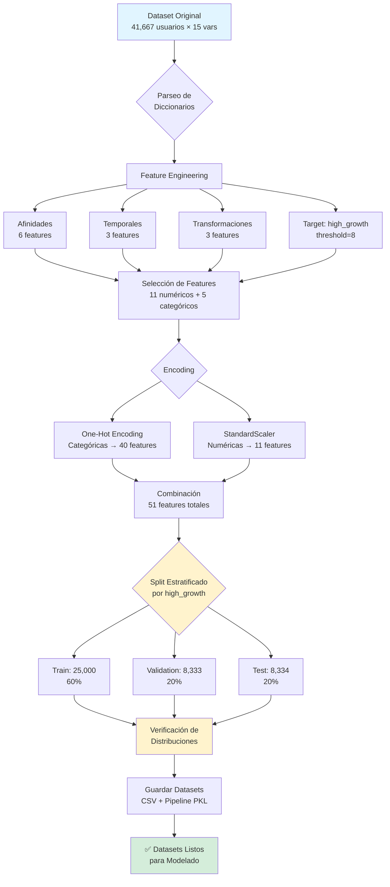

# Pipeline de Preparación de Datos

## Diagrama de Flujo del Proceso



## Detalle de Transformaciones por Etapa

### 1. Parseo de Diccionarios
- **Input:** Strings de diccionarios en 4 columnas
  - `main_category_counts`
  - `ka_type_counts`
  - `shop_name_counts`
  - `brand_name_counts`
- **Proceso:** `ast.literal_eval()` para convertir strings a dict
- **Output:** Diccionarios parseados listos para procesar

### 2. Feature Engineering

#### 2.1 Features de Afinidades (6 nuevos)
| Feature | Descripción | Cálculo |
|---------|-------------|---------|
| `dominant_category` | Categoría con más órdenes | `max(category_counts, key=counts.get)` |
| `category_diversity` | Índice de Shannon | `H = -Σ(p_i × log(p_i))` |
| `num_categories` | Categorías únicas | `len(category_counts)` |
| `num_shops` | Tiendas únicas | `len(shop_counts)` |
| `num_brands` | Marcas únicas | `len(brand_counts)` |
| `brand001_ratio` | Ratio marca dominante | `brand001_count / total_orders` |

#### 2.2 Features Temporales (3 nuevos)
| Feature | Descripción | Tipo |
|---------|-------------|------|
| `is_weekend_first_order` | Primera orden en fin de semana | Binario (0/1) |
| `first_order_month` | Mes de primera orden | Numérico (1-12) |
| `days_since_first_order` | Días desde primera orden | Numérico |

#### 2.3 Transformaciones Numéricas (3 nuevos)
| Feature | Transformación | Propósito |
|---------|----------------|-----------|
| `log_total_orders` | `log(total_orders + 1)` | Reducir asimetría |
| `log_efo_to_four` | `log(efo_to_four + 1)` | Reducir asimetría |
| `orders_per_day` | `total_orders / days_since_first` | Velocidad promedio |

#### 2.4 Variable Objetivo
| Variable | Tipo | Definición |
|----------|------|------------|
| `high_growth` | Clasificación | `1 si delta_orders > 8, else 0` |
| `delta_orders` | Regresión | Ya existe (variable original) |

### 3. Selección de Features

#### Features Numéricos (11)
1. `total_orders_tmenos1` - Histórico
2. `efo_to_four` - Velocidad adopción
3. `log_efo_to_four` - Versión transformada
4. `category_diversity` - Shannon entropy
5. `num_categories` - Exploración
6. `num_shops` - Exploración
7. `num_brands` - Exploración
8. `brand001_ratio` - Lealtad
9. `days_since_first_order` - Antigüedad
10. `orders_per_day` - Velocidad
11. `first_order_month` - Estacionalidad

#### Features Categóricos (5)
1. `categoria_recencia` - Impacto 7x (EDA)
2. `city_token` - Geografía
3. `r_segment` - Segmentación
4. `dominant_category` - Preferencia
5. `is_weekend_first_order` - Patrón temporal

### 4. Encoding y Scaling

#### One-Hot Encoding
- **Algoritmo:** `OneHotEncoder(drop='first')`
- **Input:** 5 variables categóricas
- **Output:** 40 features binarios
- **Ejemplo:**
  ```
  categoria_recencia = "cat001"
  → categoria_recencia_cat002=0, categoria_recencia_cat003=0, ...
  ```

#### StandardScaler
- **Algoritmo:** `StandardScaler()` (z-score)
- **Input:** 11 features numéricos
- **Output:** 11 features estandarizados (μ=0, σ=1)
- **Fórmula:** `z = (x - μ) / σ`

### 5. Splitting Estratificado

#### Configuración
- **Estrategia:** Stratified split por `high_growth`
- **Proporciones:** 60% / 20% / 20%
- **Seed:** `random_state=42` (reproducibilidad)

#### Resultados
| Conjunto | Tamaño | % high_growth |
|----------|--------|---------------|
| Original | 41,667 | 20.36% |
| Train | 25,000 | 20.36% |
| Validation | 8,333 | 20.35% |
| Test | 8,334 | 20.36% |

**✅ Distribución preservada:** Diferencias < 0.01%

### 6. Verificación de Calidad

#### Checks Implementados
- ✅ No hay valores faltantes en features
- ✅ Scaling correcto: media ≈ 0, std ≈ 1
- ✅ Encoding correcto: features binarios
- ✅ Distribución de `high_growth` preservada
- ✅ Estadísticas de `delta_orders` similares entre conjuntos

#### Estadísticas de delta_orders
| Métrica | Original | Train | Validation | Test |
|---------|----------|-------|------------|------|
| Mean | 6.85 | 6.85 | 6.84 | 6.89 |
| Std | 4.96 | 4.87 | 5.11 | 5.06 |
| Min | 1.00 | 1.00 | 1.00 | 1.00 |
| 25% | 4.00 | 4.00 | 4.00 | 4.00 |
| 50% | 5.00 | 5.00 | 5.00 | 5.00 |
| 75% | 8.00 | 8.00 | 8.00 | 8.00 |
| Max | 108.00 | 95.00 | 108.00 | 65.00 |

### 7. Outputs Generados

#### Archivos CSV
```
data/processed/
├── train.csv      (25,000 × 54) - 9.5 MB
├── val.csv        (8,333 × 54)  - 3.2 MB
└── test.csv       (8,334 × 54)  - 3.2 MB
```

**Estructura de cada CSV:**
- 51 features (11 numéricos escalados + 40 categóricos encoded)
- 2 targets: `high_growth`, `delta_orders`
- 1 identificador: `uid`

#### Pipeline Serializado
```
models/
└── feature_engineering_pipeline.pkl - 3.9 KB
```

**Contenido del pickle:**
```python
{
    'scaler': StandardScaler (fitted),
    'encoder': OneHotEncoder (fitted),
    'numeric_features': list[str] (11 nombres),
    'categorical_features': list[str] (5 nombres),
    'encoded_feature_names': list[str] (40 nombres)
}
```

**Uso en producción:**
```python
import pickle

with open('models/feature_engineering_pipeline.pkl', 'rb') as f:
    pipeline = pickle.load(f)

# Aplicar transformaciones a nuevos datos
X_new_scaled = pipeline['scaler'].transform(X_new[pipeline['numeric_features']])
X_new_encoded = pipeline['encoder'].transform(X_new[pipeline['categorical_features']])
```

## Resumen Ejecutivo

### Input
- **Dataset original:** 41,667 usuarios × 15 variables
- **Calidad:** 100/100 (0% missing, 0% duplicados)
- **Período:** 6 meses (cohorte 4ta orden)

### Proceso
1. **Parseo:** 4 columnas diccionario → estructuras procesables
2. **Feature Engineering:** +12 features derivados (afinidades, temporales, transformaciones)
3. **Selección:** 16 features relevantes (11 numéricos + 5 categóricos)
4. **Encoding:** 5 categóricas → 40 features binarios
5. **Scaling:** 11 numéricas → estandarizadas (μ=0, σ=1)
6. **Splitting:** Estratificado 60/20/20 por `high_growth`

### Output
- **Train:** 25,000 usuarios × 54 columnas (60%)
- **Validation:** 8,333 usuarios × 54 columnas (20%)
- **Test:** 8,334 usuarios × 54 columnas (20%)
- **Pipeline:** Transformers serializados para producción

### Métricas de Calidad
- ✅ **Distribución preservada:** high_growth 20.36% en todos los conjuntos
- ✅ **Sin missing values:** 0% en features seleccionados
- ✅ **Scaling verificado:** Media ≈ 0, Std ≈ 1
- ✅ **Reproducibilidad:** random_state=42 en todos los pasos

---

**Fecha de generación:** 2025-11-23
**Script:** `scripts/run_data_preparation.py`
**Notebook:** `notebooks/01_data_preparation.ipynb`
